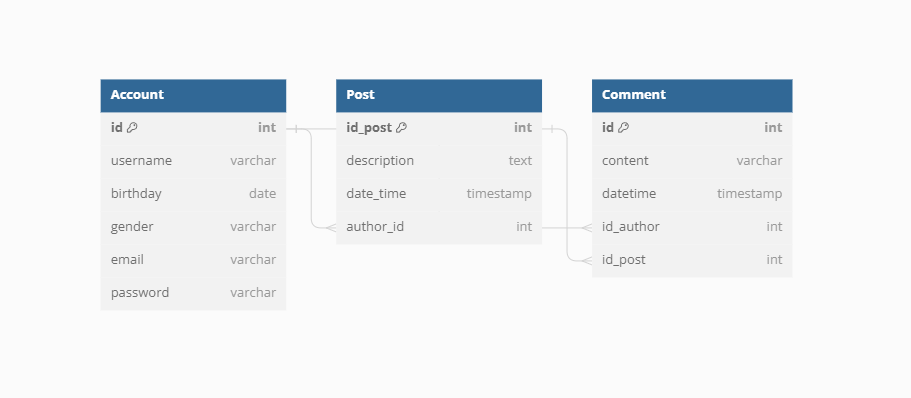

# Social Network With Java

A backend for a social network made with Java

## Author : AndoKami (https://github.com/AndoKami) - Ramanantsoa Ando N'irina


## Run Locally for test the project 

Clone first

```bash
  https://github.com/AndoKami/SocialNetBackend-java.git
```

Go to the project directory

```bash
  cd ./SocialNetBackend-java
```

## How the MCD look like 

